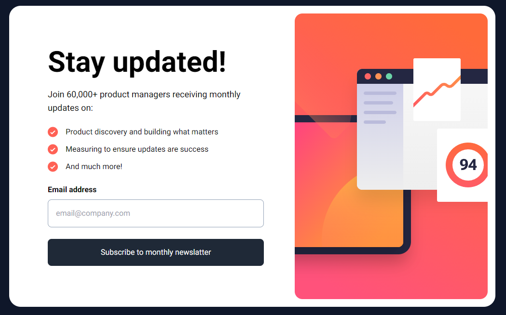
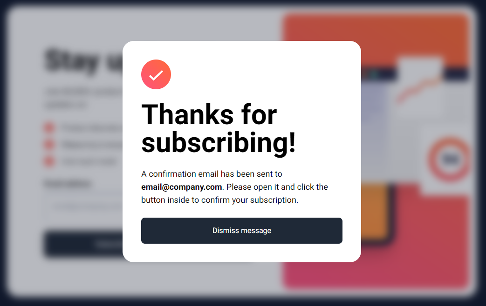

# Newsletter

Este é um projeto [Next.js](https://nextjs.org/) de cadastro de email em uma Newsletter baseado em um desafio do [FrontEnd-Mentor](https://www.frontendmentor.io/challenges/newsletter-signup-form-with-success-message-3FC1AZbNrv). 

## Rodando Localmente

Clone o projeto

```bash
  git clone https://github.com/HigorSR/Newsletter.git
```

Entre no diretório do projeto

```bash
  cd Newsletter
```

Instale as dependências

```bash
  npm install
  # or
  yarn install
```

Inicie o servidor

```bash
  npm run dev
  # or
  yarn dev
```

## Screenshots

<div align="center">
  
  
</div>

## Stack utilizada

**Front-end:** React.js, Next.js, TailwindCSS
